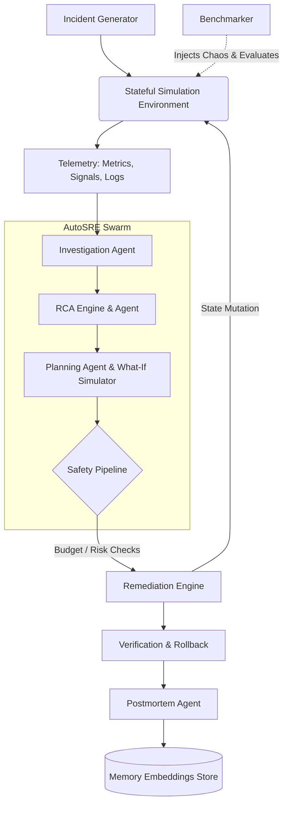

# AutoSRE
**Autonomous SRE Incident Response Benchmark & Simulation Platform**

Testing autonomous AI agents in live production environments is prohibitively dangerous, yet developing robust SRE agents requires observing their behavior against dynamic, stateful infrastructure failure scenarios. AutoSRE provides a deterministic, stateful simulation environment and rigorous benchmarking suite to safely evaluate LLM-driven incident detection, root-cause analysis, and remediation workflows before they ever touch production.

---

## 🎥 Demo


*The AutoSRE Interactive Dashboard provides a real-time console to observe the agent's decision-making process, safety gates, and counterfactual What-If planning during simulated incidents.*

## 🏗️ Architecture



## ✨ Core Capabilities

- **Stateful Infrastructure Simulator:** Injects realistic faults (e.g. CPU exhaustion, DB connection drops). Mutating the state naturally resolves the metrics.
- **Evidence-Based RCA:** Evaluates causal chains over naive keyword matching.
- **Counterfactual What-If Engine:** Deep-copies the environment to simulate remediation impacts before executing them, outputting structured utility scores.
- **Rigorous Benchmarking Suite:** Deterministic evaluation of multiple agents with per-scenario metrics (MTTR, Action Count, Safety Score, Cost, Abstention Rate).
- **Multi-Agent Orchestrator:** Separation of concerns across Investigation, RCA, Planning, Remediation, and Postmortem agents.

## 🛡️ Safety Model

AutoSRE enforces a strict, isolated Safety Pipeline independent of the LLM's own reasoning:

1. **Risk Classification:** Every tool is statically assigned a baseline risk (LOW, MEDIUM, HIGH, CRITICAL).
2. **Blast Radius Analysis:** Dynamically evaluates the target service (LOCAL, REGIONAL, GLOBAL).
3. **Budget Check:** Actions consume an "Error Budget". Exhausted budgets result in automatic rejection.
4. **Approval Gate:** High-risk actions on global blast radiuses are automatically blocked requiring explicit overrides.
5. **Snapshot & Verification:** State is captured before execution. If post-execution metrics do not recover, a rollback is triggered.

## 📊 Benchmark Results

*Run using seed 42 with 12 incident scenarios.*

| Agent                | RCA     | Recov   | MTTR    | p95     | Acts  | Abst   | Safety  |
|----------------------|---------|---------|---------|---------|-------|--------|---------|
| **RandomBaseline**   | 0%      | 50%     | 0.0s    | 0.0s    | 0.0   | 100%   | 100%    |
| **RuleBasedBaseline**| 0%      | 100%    | 0.0s    | 0.0s    | 0.0   | 100%   | 100%    |
| **AutoSRE_v3**       | 100%    | 92%     | 0.0s    | 0.0s    | 6.5   | 0%     | 54%     |

*Full machine-readable results are exported to `results/benchmark.csv` and `results/benchmark.json`.*

## 🌪️ Scenarios

The Chaos Injector natively supports:
- `cpu_failure`: CPU exhaustion via rogue processes.
- `network_latency`: Upstream timeouts and dropped packets.
- `database_failure`: Connection pool exhaustion.
- `adversarial_cpu`: Multi-failure cascading issues designed to confuse naive heuristics.

## 📝 Example Incident

**Scenario:** `adversarial_cpu` injected.
**Detection:** SignalStore flags `connection pool exhausted` and CPU > 95%.
**Investigation:** Agent extracts recent metrics and discovers anomalous Python process alongside DB errors.
**RCA:** Engine correlates the DB failure to the application retrying aggressively, causing the CPU spike.
**What-If Plan:** Evaluates restarting Nginx (Utility: -0.5) vs Terminating Python Process (Utility: 0.9).
**Execution Gate:** Safety Policy Approves (Risk: Medium, Blast: Regional).
**Verification:** State stabilizes. Agent generates a postmortem markdown report and archives it into Memory.

## 🛠️ Installation

AutoSRE requires Python 3.9+.

```bash
git clone https://github.com/VyomVadodariya/AutoSRE-PostMortem.git
cd AutoSRE-PostMortem

# Create and activate virtual environment
python -m venv .venv
source .venv/bin/activate  # On Windows: .venv\Scripts\activate

# Install with dependencies
pip install -e .
```

## 🚀 Usage

**Start the Interactive Dashboard:**
```bash
streamlit run dashboard/app.py
```
This launches the UI where you can manually trigger incidents in the Chaos Lab and watch the Orchestrator respond.

**Run the Benchmark Suite:**
```bash
python run_benchmark.py --episodes 50 --seed 42 --out-dir results
```
*Outputs aggregate metrics to the console and exports detailed data to `results/`.*

## 🧪 Testing

The repository maintains a rigorous pytest suite covering adapters, safety policies, environment behavior, and orchestrator state-machine transitions.

```bash
pytest
```

## 📁 Project Structure

- `adapters/`: Experimental interfaces for real-world platforms (e.g., Kubernetes).
- `agents/`: Pluggable agent implementations (Investigation, RCA, Planning, Baselines).
- `dashboard/`: Streamlit interactive demonstration console.
- `environment/`: Stateful simulator, metrics/signals store, and chaos injector.
- `evaluation/`: Deterministic benchmark orchestrator.
- `policies/`: Safety pipeline, risk classification, and error budgets.
- `tools/`: Extensible tool registry.
- `tests/`: Extensive pytest suite.

## ⚠️ Limitations

- **Simulation Only:** The default environment is fully simulated.
- **Experimental Kubernetes Adapter:** The Kubernetes adapter in `adapters/` is a scaffolded dry-run implementation. It is **NOT** production-ready and does not actually mutate live clusters.
- **Mocked ML Models:** RCA accuracy and text generation in the default test suites use deterministic heuristics to ensure reproducible benchmarking, rather than actual LLM calls.

## 🗺️ Roadmap

- [x] Phase 1: Core simulation + incident response
- [x] Phase 2: Counterfactual What-If Engine
- [x] Phase 3: Safety Pipeline Architecture
- [x] Phase 4: Deterministic Benchmarking Framework
- [ ] Phase 5: Live LLM Integration (OpenAI/Anthropic)
- [ ] Phase 6: Real-world Observability Ingestion (Prometheus/Datadog)
- [ ] Phase 7: Production-Ready Kubernetes Adapter

## 🤝 Contributing

Contributions are welcome! Please ensure all PRs pass the test suite and do not break deterministic backward compatibility in the `evaluation/` module.

## 📄 License

MIT License. See [LICENSE](LICENSE) for more details.